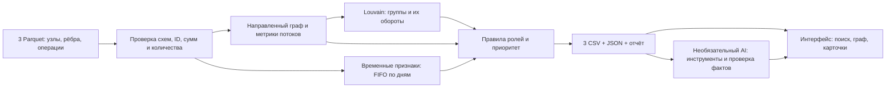

# Анализ транзакций

Инструмент для аналитика, который помогает исследовать сеть внутрибанковских переводов и выбрать клиентов для ручной проверки. Проект читает три Parquet-файла, проверяет их согласованность, предлагает наблюдаемые роли клиентов, выделяет группы и объясняет приоритет исследования. Результат можно изучить в веб-интерфейсе и выгрузить в три CSV. Основной сценарий работает локально без LLM; AI-ассистент доступен как дополнительный режим.

Результат — объяснимая эвристическая оценка для дальнейшего расследования. Роль и приоритет не доказывают мошенничество; точность классификации на размеченной выборке не измерялась.

## Что реализовано

- Проверка узлов, рёбер и операций, включая суммы и количества по направленным парам; сохранение изолированных клиентов и повторных строк операций.
- Расчёт графовых и временных признаков, групп Louvain, шести гипотез ролей и приоритета клиентов с численным объяснением.
- Три конкурсные CSV, JSON для интерфейса и краткий отчёт; все результаты воспроизводятся из исходных Parquet одной командой.
- Веб-интерфейс с общим графом, поиском клиента, окружением на один или два шага, группами, операциями и локально сохраняемыми заметками расследования.
- Дополнительный AI-ассистент: диалог по текущему анализу, аналитические инструменты и серверная сверка фактических утверждений. Для него нужен ключ OpenAI API.

## Как работает решение

1. Python читает `data/nodes.parquet`, `data/edges.parquet` и `data/transactions.parquet`, проверяет схему и согласованность данных.
2. Анализ строит направленный граф, считает потоки и временные признаки, формирует группы, роли и приоритеты.
3. Экспорт создаёт `nodes_roles.csv`, `clusters.csv`, `top_nodes.csv`, `graph.json`, `summary.json` и `report.md`.
4. Интерфейс загружает готовый `graph.json`: аналитик находит клиента, видит основания роли и связанные переводы, затем скачивает CSV для дальнейшей проверки. В режиме агента вопрос и выбранный контекст поступают в локальный Python API, который обращается к OpenAI API и проверяет возвращённые факты.

## Технологии

| Часть | Используется |
|---|---|
| Анализ и выгрузки | Python, pandas, PyArrow, NetworkX, SciPy |
| API дополнительного агента | FastAPI, OpenAI Agents SDK, OpenAI API; модель задаётся через `OPENAI_MODEL` |
| Интерфейс | React, TypeScript, Vite, TanStack Start, Sigma, Graphology, ForceAtlas2, Radix Themes |
| Сборка и проверки | uv, npm workspaces, Turborepo, Ruff, pytest, Vitest, Playwright |

Аналитические расчёты выполняются в `backend/money_graph/`. Интерфейс в `frontend/` показывает готовые Python-результаты; отдельного расчёта ролей на TypeScript нет. Схема компонентов и структура каталогов приведены ниже.

## Установка и запуск

Для анализа из командной строки нужны Python 3.11–3.14 и uv; для интерфейса дополнительно нужны Node.js 22.12+ либо 24+ и npm 11. Все команды выполняются из корня репозитория. Python-зависимости закреплены в `backend/uv.lock`, npm-зависимости всех рабочих пакетов — в корневом `package-lock.json`.

Для проверки пайплайна на чистой машине достаточно Python и uv. Одна команда устанавливает закреплённые зависимости и пересчитывает исходные Parquet в три конкурсных CSV и дополнительные артефакты:

```bash
uv run --project backend --locked money-graph --data data --out out
```

Node.js, ключ API, платные сервисы и GPU для этой команды не нужны. Первый запуск может потребовать интернет для установки зависимостей; сам расчёт выполняется локально. Для повторного расчёта после установки: `make analyze`. Лимит в пять минут относится к пересчёту данных, без установки окружения.

Для установки и запуска интерфейса:

```bash
make setup
make start
```

`make setup` создаёт `backend/.venv`, устанавливает Python-зависимости с поддержкой агента и выполняет корневой `npm ci`. `make start` запускает Turborepo: сначала подготавливает CSV/JSON через Python-анализ, затем запускает веб-интерфейс на **http://127.0.0.1:5173**. Если анализ завершается с ошибкой, интерфейс не запускается. `Ctrl+C` останавливает dev-сервер.

Те же действия без Make:

```bash
uv sync --project backend --locked --extra agent
npm ci
npm run dev
```

В каталоге `data/` уже находятся `nodes.parquet`, `edges.parquet` и `transactions.parquet` из предоставленного архива; исходный датасет включён в репозиторий. Результаты анализа исключены из Git. Обычный режим работает локально без API-сервера и ничего не отправляет во внешние сервисы.

| Команда из корня | Назначение |
|---|---|
| `make setup` | Установить закреплённые Python- и npm-зависимости |
| `make start` / `npm run dev` | Подготовить данные и запустить локальный интерфейс без LLM |
| `make start-agent` / `npm run start:agent` | Запустить Python API и интерфейс с AI-агентом |
| `make analyze` | Создать CSV, JSON и отчёт в `out/` без интерфейса |
| `make build` / `npm run build` | Подготовить данные и собрать сайт в `frontend/dist/client/` |
| `npm run preview` | Собрать сайт и открыть предварительный просмотр на порту 5173 |
| `make check` / `npm run check` | Проверить Python-стиль, типы интерфейса и все тесты |

Отдельный запуск анализа и дополнительные параметры:

```bash
make analyze ARGS="--top 30 --window-days 2"
uv run --project backend --frozen money-graph --data data --out out
```

Параметры: `--top 50` (минимум 20), `--window-days 3` (1–30), `--seed 42`, `--resolution 1.0`. Для набора меньше 20 узлов экспортируются все узлы. Ошибка входных данных завершает команду с кодом 1 и понятным сообщением.

## Как проверить решение

Из корня репозитория выполните `make setup`, затем `make analyze` и `make start`. Откройте [локальный интерфейс](http://127.0.0.1:5173) и повторите сценарий:

1. В меню «Выбрать клиента» найдите `100000006704530100` и откройте «Исследование». Сопоставьте предложенную роль `transit`, входящие и исходящие суммы с переводами по датам.
2. В «Визуализации» откройте окружение клиента на один и два шага, затем перейдите в «Группы клиентов» и изучите связи группы.
3. Нажмите «Скачать данные» и откройте `nodes_roles.csv`, `clusters.csv` и `top_nodes.csv`. Те же файлы после `make analyze` находятся в `out/`; проверьте строку выбранного `gid` в `nodes_roles.csv`.

Основной сценарий не требует ключа API. Более подробный [пятиминутный сценарий](docs/demo.md) содержит другие примеры клиентов и проверку схем CSV.

## Локальный фронтенд

Интерфейс находится в npm workspace `frontend/` и использует React, TypeScript, Vite, TanStack Start и Sigma (WebGL). Раскладка связей ForceAtlas2 рассчитывается в Web Worker; общая сеть, группы, окружение клиента и пути используют одну интерактивную отрисовку. Панель агента использует готовые компоненты Radix Themes, оформленные под новый интерфейс TRACE. Запуском и сборкой из корня управляет Turborepo; аналитические расчёты выполняются через Python.

Задача `data` записывает выгрузки в `frontend/public/generated`. Turborepo использует локальный кеш этих выгрузок, пока Python-код, Parquet-файлы и Python-зависимости не изменились. Для принудительного пересчёта выполните `npm run data`; после изменения Python-кода или исходных данных перезапустите `npm run dev`. Изменения интерфейса подхватываются Vite автоматически. Уже подготовленные данные можно открыть через `npm run dev --workspace frontend`.

В интерфейсе доступны поиск по всем 2 248 клиентам, фильтры ролей и групп, граф на 1–2 шага и обзор всей сети, выбор узла мышью, основания роли, динамика по активным дням, таблица переводов с датами и направлениями, группы и скачивание CSV/JSON. ID сохраняются строками. Большие окружения ограничиваются 250 узлами с явным счётчиком; обзор показывает все узлы выбранной группы или всего графа. Даты фильтруют таблицу переводов, не пересчитывая месячные роли и приоритеты.

```bash
npm run check
npm run build
npm run preview
```

`npm run check` запускает проверки TypeScript, Vitest, Ruff и pytest. `npm run build` сначала подготавливает Python-данные, затем собирает интерфейс. Готовый статический сайт находится в `frontend/dist/client`, включая `generated/`. `npm run preview` собирает и запускает предварительный просмотр на том же порту 5173; перед этим остановите dev-сервер.

Артефакты кешируются только локально: удалённый кеш Turborepo отключён, поскольку сборка содержит банковские данные. `node_modules`, `.turbo`, `dist` и `public/generated` исключены из Git. Автоматически публиковать сайт с этими данными не нужно.

### Расследования и навигация

Выбор клиента, группы, режима графа, глубины окружения, дат, направления и фильтров отражается в URL. Обновление страницы и кнопки браузера «Назад»/«Вперёд» восстанавливают контекст. Большие ID остаются строками. Ссылка относится к конкретной версии анализа; несовместимый анализ не получает старые фильтры автоматически.

В режиме группы отображаются все её участники. Переключатель внешних контрагентов добавляет непосредственные связи с другими группами; связи внешних клиентов между собой не включаются. В профиле графа клиента доступны один и два шага окружения с явным ограничением 250 клиентов и числом скрытых узлов.

Общий граф открывает всех клиентов. Поиск приближает клиента или группу, фильтры и список узлов открываются поверх карты. Клик выделяет узел без перехода и сброса масштаба; карточка содержит отдельное действие открытия клиента. Узлы можно перетаскивать, пустое пространство — двигать. Колесо меняет масштаб, Shift + колесо или кнопка поворота вращают карту. Раскладка автоматически останавливается; кнопка воспроизведения продолжает её. Цвета ролей и подписи переключаются в настройках вида.

Панель «Расследования» сохраняет по кнопке название, заметки, текущий контекст и выбранные основания в localStorage этого браузера. Можно добавлять клиента, отфильтрованные операции и карточки из ответа AI. Черновик до сохранения не переживает обновление страницы. Записи другого анализа доступны для экспорта Markdown/JSON; они не открываются поверх текущего графа. Экспорт включает контекст, основания, направление и периоды операций.

Карточка клиента показывает три ведущие роли с исходными оценками до поправок, разницу двух лучших оценок и составляющие приоритета. Близкие роли (разница меньше 0,05) отмечены как конкурирующие гипотезы. Оценки не являются вероятностями.

### Режим AI-агента

Создайте `.env` в корне по образцу `.env.example`, укажите `OPENAI_API_KEY` и при необходимости `OPENAI_MODEL` (по умолчанию `gpt-6-luna`), затем выполните `make start-agent` или `npm run start:agent`. Команда запускает Python API на `http://127.0.0.1:8000` и интерфейс на `http://127.0.0.1:5173`; `Ctrl+C` останавливает оба процесса. API самостоятельно рассчитывает данные один раз при запуске, а Vite передаёт ему запросы `/api` и `/generated`.

Без ключа просмотр графа доступен, AI-ответы недоступны. При обращении к агенту вопрос и контекст исследования передаются внешнему LLM API. Ключ остаётся на сервере. Панель автоматически сохраняет завершённые вопросы и ответы, основания и ход исследования в localStorage этого браузера. Боковой список слева показывает чаты текущего анализа с датами и названиями по первому вопросу. В нём доступны создание, поиск по названию и тексту, переименование и удаление отдельного чата с подтверждением. Список сворачивается после выбора диалога или создания нового чата и открывается кнопкой «Чаты»; выбранное состояние сохраняется после обновления страницы. На телефоне он выдвигается поверх переписки. Можно переключаться между диалогами и возвращаться к выбранному чату после обновления страницы, в том числе без доступного API. Названия и удаления также сохраняются в браузере. Чаты другого анализа сохраняются отдельно и не применяются к текущему графу.

Контекст для продолжения диалога хранится в памяти API до 8 вопросов и 30 минут бездействия. После завершения или истечения сеанса следующий вопрос создаёт отдельный чат; сохранённая переписка остаётся доступна для чтения. Перезапуск API завершает серверные сеансы: при попытке продолжения сервер сообщит об истечении диалога. История привязана к этому браузеру и адресу приложения; очистка данных сайта удаляет её. При недоступном или заполненном хранилище панель сообщает, что переписку не удалось сохранить.

Если задача непонятна, агент просит уточнить вопрос без вызова инструментов и аналитических секций. Выбранный клиент и фильтры сами по себе не запускают исследование. Уточнение сохраняется в переписке; следующий понятный вопрос продолжает тот же диалог.

При исследовании панель показывает этапы thinking, вызовы инструментов и краткое резюме рассуждений, если модель его возвращает. Ответ появляется постепенно через SSE; до проверки ссылок он помечен как формирующийся. Модель возвращает структурированные утверждения с полем и точным значением. Сервер сверяет их с разрешёнными данными инструмента и версией анализа, затем сам формирует тексты проверенных фактов. Свободная интерпретация и гипотезы модели обозначены отдельно; проверка не делает их подтверждёнными выводами. Карточки доказательств и история обновляются только после успешной проверки полного ответа. «Остановить» отменяет обработку; незавершённый ответ не сохраняется. Для модели настроен reasoning effort `low`.

## Результаты

| Файл | Содержание |
|---|---|
| `nodes_roles.csv` | Все входные клиенты, включая изоляты; роль, обоснованность, кластер, приоритет и объяснение до 200 символов |
| `clusters.csv` | Группы, число клиентов/seed, внутренний оборот, ведущие узлы и структурная гипотеза |
| `top_nodes.csv` | Ранжированный список; по умолчанию 50 клиентов, с численными причинами приоритета |
| `graph.json` | Узлы, рёбра, группы, топ, дневные потоки, исходные транзакции и метаданные |
| `summary.json` | Количества, параметры, методы, ограничения, SHA-256 нормализованных данных |
| `report.md` | Краткий читаемый отчёт с первыми десятью узлами |

Конкурсные CSV имеют ровно заданные ТЗ колонки, в указанном порядке:

```text
nodes_roles.csv: gid,role,role_score,cluster_id,priority_score,evidence
clusters.csv: cluster_id,n_nodes,n_seed,sum_kzt_internal,top_gids,hypothesis
top_nodes.csv: rank,gid,role,priority_score,why
```

В CSV нет пустых обязательных значений; `evidence` содержит не более 200 символов. `gid` записан десятичным int64 без округления. При импорте в электронные таблицы выбирайте текстовый тип для ID, чтобы приложение не потеряло младшие разряды. `top_gids` разделены `;`.

Расширенные признаки, альтернативные роли, вклады приоритета и внешние потоки групп сохраняются в `graph.json`; их определения приведены в [методике](docs/methodology.md). Неопределимое отношение исходящих к входящим представлено в JSON как `null` вместе с `pass_through_available=false`. Аналогично представлена временная доля без входящих.

## Архитектура проекта

### Схема решения



Все метрики, роли, группы и приоритеты рассчитывает Python. LLM получает результаты ограниченных аналитических инструментов, а сервер сверяет фактические утверждения с текущим расчётом; свободные интерпретации отделены от проверенных фактов. Без LLM доступны весь основной анализ, интерфейс и выгрузки.

## Данные и интеграции

Источник данных — включённые в репозиторий Parquet-файлы из предоставленного для кейса архива: клиенты, агрегированные направленные рёбра и отдельные транзакции. Анализ не загружает данные из банка или сторонней базы. В обычном режиме все вычисления и просмотр выполняются локально.

Дополнительный агент использует OpenAI API через OpenAI Agents SDK. Для запуска нужен `OPENAI_API_KEY` в корневом `.env`; пример переменных находится в [.env.example](.env.example). Ключ не должен попадать в GitHub: `.env` исключён из Git. NVIDIA API и GPU в текущем коде не используются. Заметки расследования и история чатов сохраняются в `localStorage` браузера, а активный контекст диалога — в памяти локального API.

## Критерии ролей и приоритета

`P(x)` — процентиль положительных значений признака внутри текущей выборки, нулевому значению соответствует 0. `in_deg`/`out_deg` — число разных внешних контрагентов; самопереводы исключены. `T` — доля поступлений, совместимая с исходящими в следующие дни выбранного окна без повторного использования входящих сумм. Выбирается роль с максимальной поддержкой; при равенстве порядок: consolidator, transit, distributor, terminal, coordinator, peripheral.

| Роль | Условие | Поддержка |
|---|---|---|
| `consolidator` | `in_deg ≥ 3` | `0.40·min(in_deg/8,1) + 0.30·in_deg/(in_deg+out_deg) + 0.15·P(in_amount) + 0.15·P(in_tx)` |
| `distributor` | `out_deg ≥ 3` | Та же формула по исходящим суммам, количеству и контрагентам |
| `transit` | Есть вход и выход; не seed; `B = min(in_amount,out_amount)/max(in_amount,out_amount) ≥ 0.5` | `0.45·B + 0.35·T + 0.20·min(active_days/5,1)` |
| `terminal` | Есть входящие, нет внешних исходящих | `0.55 + 0.15·P(in_amount)` |
| `coordinator` | Есть вход и выход; `P(betweenness) ≥ 0.85`; ≥2 соседних групп и ≥2 достижимых источников seed | `0.40·P(betweenness) + 0.20·min(neighbor_clusters/3,1) + 0.20·min(seed_sources/5,1) + 0.20·min((in_deg+out_deg)/10,1)` |
| `peripheral` | Базовая гипотеза | `0.30`; при отсутствии внешних связей — `0`, приоритет также `0` |

После выбора роли поддержка `terminal` на границе четвёртого колена ограничивается `0.20` и получает статус `boundary_hypothesis`; для terminal-seed предел `0.35`. Поддержка `transit` при неполном последующем временном окне умножается на `0.85`. Граничный terminal — наблюдаемый конец обхода, а не установленный конечный получатель; предупреждение сохраняется и в `evidence` конкурсного CSV.

Приоритет складывается из `0.25·P(betweenness) + 0.20·P(turnover) + 0.15·P(tx_count) + 0.15·min(seed_sources/5,1) + 0.15·role_score + 0.10·T`. Для seed временной вклад равен нулю. Сортировка — по убыванию приоритета, при равенстве по gid. В `top_nodes.csv` поле `why` объясняет численные вклады и наблюдения, а JSON сохраняет полное разложение. Оценки являются эвристиками, не вероятностями виновности. Полные определения и ограничения — в [методике](docs/methodology.md).

### Контракт для фронтенда

- `schema_version=1` находится в `metadata`.
- **Все `gid`, `src`, `dst` в JSON — строки.** Исходные int64 больше безопасного диапазона JavaScript. `top_gids` — массив строк; в CSV это строка с `;` между ID.
- Денежные значения `*_minor` — целые тиыны; `*_kzt` — значения для отображения. Общий объём проверяется на безопасный диапазон JSON-чисел.
- `date` — `YYYY-MM-DD`. Времени внутри дня нет.
- `role_candidates` — применимые роли и исходные оценки по убыванию до поправок; `role_margin` — разница двух лучших или `null`. `priority_components` содержит вклады, сумма которых равна приоритету с учётом округления.
- `role_score` — эвристическая поддержка роли, `priority_score` — приоритет исследования. Оба в диапазоне 0–1 и не являются вероятностями мошенничества.
- У `terminal` проверяйте `role_status` и `truncated_by_depth`: `boundary_hypothesis` означает неподтверждённую конечную роль на границе обхода.
- `flags` — массив пометок; во всех узлах есть `partial_observation`.
- Для построения графа используйте строковые ID напрямую. Не преобразуйте их через `Number()`.

## Проверка предоставленного датасета

Локальный запуск подтвердил 2 248 клиентов, 3 119 рёбер, 4 840 транзакций и сумму по рёбрам 365 890 012,01 ₸ за 1–31 июля 2026 года. Это оборот по наблюдаемым переводам: одна и та же сумма может учитываться на нескольких шагах цепочки.

Сохранены 19 изолированных seed-клиентов и 97 повторных строк транзакций. Без transaction ID эти строки нельзя автоматически считать ошибочными дублями. Все 444 клиента четвёртого колена помечены как граница наблюдения. Суммы и количества переводов по каждой направленной паре совпадают с `edges.parquet`.

При параметрах по умолчанию получены 67 групп Louvain, включая одноузловые группы, и топ-50. Это результат выбранной эвристики кластеризации, а не установленное число экономических организаций.

## Ограничения

- Выборка содержит только наблюдаемые переводы. У клиентов на четвёртом колене продолжение цепочки неизвестно, а у исходных клиентов входящий поток неполон.
- Сопоставление сумм в пределах дней и наличие пути в графе не подтверждают происхождение конкретных денег. Оценки ролей и приоритета не являются вероятностями нарушения; размеченной проверки качества нет.
- Текущий расчёт и загрузка полного `graph.json` в браузер рассчитаны на предоставленный небольшой набор данных. В окружении клиента интерфейс показывает не более 250 узлов; общий граф и группа доступны целиком.
- История агента и сохранённые расследования привязаны к браузеру. Серверные сеансы диалога не переживают перезапуск API; AI-режим зависит от доступности OpenAI API.

### Масштабирование до ~1 млн узлов

Текущая реализация предназначена для предоставленного небольшого батча. Основные ограничения на большом графе — точное посредничество по всем источникам, память объектов NetworkX и передача всех операций в браузер. Лимит пяти минут на миллион узлов не заявляется: он зависит также от числа рёбер и транзакций.

| Часть | Изменение при росте объёма |
|---|---|
| Чтение и проверки | Читать Parquet пакетами, выбирать нужные столбцы, агрегировать пары и дни в DuckDB/Polars или Arrow; сверять суммы и количества без загрузки всей таблицы операций в память |
| Хранение графа | Перейти к компактным индексам вершин и разреженным массивам смежности, использовать CPU-реализацию igraph/NetworKit; сохранить исходные int64 ID в таблице соответствия |
| Центральности | Вместо точного betweenness с затратами порядка `O(V·E)` использовать воспроизводимую выборку источников; отдельно измерить изменение топа и ошибку на малых подграфах |
| Группы и достижимость | Обрабатывать независимые слабые компоненты, использовать Louvain/Leiden в компактном движке; кешировать обходы от seed и выполнять индивидуальные пути по запросу |
| Временные признаки | Сортировать/разбивать операции по клиенту и дате, выполнять FIFO по независимым клиентам; промежуточные результаты хранить на диске |
| API и интерфейс | Отдавать агрегаты групп и ограниченные окружения по запросу; поиск и пагинацию операций перенести на сервер, не отправлять миллион узлов и все операции одним JSON |
| Проверка качества | Зафиксировать версии/параметры приближений, измерить время и память на нескольких размерах, сравнить роли и топ с точным расчётом на контрольной выборке |

Расчёт остаётся возможным на CPU; облачный кластер и GPU не являются обязательной частью подхода. Потребность в памяти и количестве процессов определяется измерениями на целевом объёме. При смене алгоритмов нужна повторная экспертная проверка порогов и устойчивости приоритетов.

## Демо и сдача

[Сценарий на 5 минут](docs/demo.md) включает живой пересчёт, выгрузки, поиск произвольного gid и разбор трёх узлов: координатора, транзита и границы обхода. Основной сценарий не зависит от доступности LLM API.

Перед сдачей выполните `npm run check`, `npm run build` и команду пересчёта выше. Отправьте актуальные исходники и README в GitHub-репозиторий команды. Каталог `out/` исключён из Git: три CSV воспроизводятся командой `make analyze` и при необходимости передаются отдельно. Проверьте, что новые исходные файлы включены в отправленный репозиторий: локальные незакоммиченные файлы не появятся в чужом клоне автоматически. Не отправляйте `.env` и API-ключи. Исходные данные используются только в рамках хакатона.

## Проверки разработки

Все проверки из корня через Turborepo:

```bash
npm run check
```

Браузерные регрессии:

```bash
npx playwright install chromium
npm run data
npm run check:e2e
```

Playwright использует интерфейс на порту 5173 (или запускает его, если порт свободен) и проверяет группу → клиента → окружение → операции, URL/reload/back, сохранение расследования и точное открытие операций из основания. Используются локальные данные без вызовов LLM. Функции сценариев в `frontend/e2e/scenarios.mjs` также поддерживают запуск через browser tool Codex. Трейсы и скриншоты ошибок остаются локально и исключены из Git.

Отдельные проверки:

```bash
make check-backend
make check-frontend
```

Тесты Python находятся в `backend/tests/`, тесты интерфейса — рядом с кодом в `frontend/src/`. Тесты проверяют согласованность входа, целые тиыны, большие ID, сохранение повторных транзакций и изолятов, границу глубины, ограничения seed, направление потоков, отсутствие двойного учёта во временном сопоставлении, самопереводы, CLI, побайтовый детерминизм экспортов при перестановке входных строк и контракт агента.

## Структура репозитория

```text
backend/
  money_graph/       Python-анализ, CLI и API агента
  tests/             тесты Python
  pyproject.toml     зависимости, команды и настройки Python
  uv.lock            закреплённые версии Python-зависимостей
frontend/
  src/               React-интерфейс, маршруты TanStack Start и тесты
  scripts/           совместный запуск интерфейса с API
  public/generated/  результаты Python для локального интерфейса
  package.json       зависимости и команды workspace интерфейса
data/                исходные Parquet-файлы
docs/                методика анализа
out/                 результаты отдельного запуска анализа
package.json         npm workspaces и общие команды
package-lock.json    единый npm lockfile
turbo.json           зависимости задач и локальное кеширование
Makefile             обёртки команд из корня
.env.example         пример настройки AI-агента
```

Роли модулей в `backend/money_graph/`: `dataset.py` — загрузка и проверки; `temporal.py` — временные признаки; `analysis.py` — граф, группы и приоритеты; `roles.py` — роли и объяснения; `export.py` — выгрузки; `cli.py` — командный интерфейс. `agent.py`, `investigation.py` и `server.py` обеспечивают необязательный режим AI-агента.

Фронтенд подключён к `graph.json`; конкурсные CSV имеют отдельную фиксированную схему. Дальнейшая валидация качества требует экспертной проверки ролей и чувствительности приоритетов. Дополнительное обучение модели потребует размеченных ролей; текущие данные такой разметки не содержат.

## Развёрнутая версия

Ссылка на публичную развёрнутую версию в репозитории не указана. Проект запускается локально на [http://127.0.0.1:5173](http://127.0.0.1:5173) по инструкции выше.
