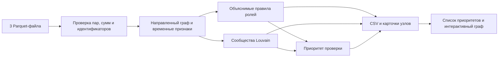

# TRACE — карта денежных связей

Локальный инструмент для AML-аналитика по кейсу HackAlem AI «Граф денег». Он рассчитывает роли всех клиентов, выделяет сообщества, формирует очередь проверки и показывает направленные переводы с объяснением каждого вывода. Роли и приоритеты — **гипотезы для проверки**, а не вывод о виновности.

## Запуск

Нужен Node.js 22.12+ и выданная организаторами папка `data/` с `nodes.parquet`, `edges.parquet` и `transactions.parquet`. В репозитории персональных или исходных данных нет.

```bash
npm ci
mkdir -p data
unzip -j '/путь/к/data.zip' 'data/*.parquet' -d data
npm start
```

После установки зависимостей **`npm start` — одна команда от сырых Parquet до трёх CSV и открытого интерфейса**. Команда пересчитывает данные, затем запускает локальный сайт по адресу `http://localhost:5173`. Полный пересчёт данного графа на ноутбуке разработчика занимает менее секунды; ограничение кейса — 5 минут. Для расчёта без сайта: `npm run analyze`. Для нестандартных путей: `npm run analyze -- --data /путь/к/data --out /путь/к/выходу`.

Результаты создаются в `public/generated/`; три CSV дополнительно записываются в `outputs/` как артефакты для репозитория:

| Файл | Содержание |
|---|---|
| `nodes_roles.csv` | Каждый клиент, основная роль, оценка поддержки роли, кластер, приоритет и доказательства |
| `clusters.csv` | Размер и наблюдаемый оборот внутри сообщества, число исходных клиентов, ключевые `gid`, осторожная гипотеза |
| `top_nodes.csv` | 50 клиентов для проверки, упорядоченных по приоритету; исходные 81 клиент исключены из очереди |
| `graph.json` | Те же результаты и признаки для интерфейса |

CSV имеют требуемые ТЗ колонки. `gid` обрабатывается как **строка с точным десятичным представлением int64**: реальные идентификаторы содержат 18 цифр и при превращении в JavaScript `number` теряют точность. В интерфейсе можно найти любой `gid`, включая изолированные исходные узлы.

## Схема решения



Реализация: TypeScript, [hyparquet](https://github.com/hyparam/hyparquet) с декодером ZSTD, [Graphology](https://graphology.github.io/) для графовых вычислений, React и [Cytoscape.js](https://js.cytoscape.org/) для локального интерфейса. Никакие внешние сервисы для расчёта не нужны.

## Как получаются роли

Пары `src → dst` направлены. `in_deg` и `out_deg` — число **разных** плательщиков и получателей; суммы и число операций считаются отдельно. Каждый узел получает одну основную роль. Правила применяются **в указанном порядке**: первое совпавшее правило побеждает. Остальные признаки и ограничения остаются в карточке.

| Роль | Формальное правило |
|---|---|
| `coordinator` | Достижим по исходящим путям длиной до 4 хотя бы от 2 разных исходных клиентов; есть хотя бы 2 плательщика и 2 получателя; направленная посредническая центральность положительна и не ниже 90-го процентиля среди её ненулевых значений |
| `distributor` | Не менее 8 разных получателей и их число не менее чем в 1,5 раза превышает число плательщиков |
| `consolidator` | Не менее 5 разных плательщиков и их число не менее чем в 1,5 раза превышает число получателей |
| `transit` | Не исходный клиент; есть вход и выход; отношение наблюдаемого исходящего объёма к входящему от 0,8 до 1,2 |
| `terminal` | Не исходный клиент, находится **до** последнего колена, получил перевод, но исходящих переводов в выгрузке нет |
| `peripheral` | Остальные случаи, включая узлы на четвёртом колене без выхода |

Для `distributor` и `consolidator` дополнительно проверяется минимум 2 контрагента на преобладающей стороне. Посредническая центральность вычисляется на **направленном графе без весов**: сумма перевода не должна превращаться в длину маршрута. `role_score` лежит в `[0, 1]` и отражает силу признаков правила. Это **не обученная вероятность**: размеченных правильных ролей нет. У терминальной гипотезы базовая оценка 0,55, а у узла четвёртого колена без выхода — лишь 0,20 для роли `peripheral`.

Временной признак `quick_out_share` показывает долю наблюдаемого исходящего объёма, отправленного в день входящего перевода или в следующие два дня. Он усиливает поддержку роли `transit`, но не доказывает движение именно полученных средств: в данных нет времени внутри дня и баланса счёта.

## Как получаются кластеры и приоритет

Для Louvain направленные связи складываются в неориентированную проекцию; вес каждого направления равен `log(1 + sum_kzt)`. Направление сохраняется для ролей и интерфейса. Генератор случайных чисел фиксирован, поэтому повторный запуск даёт те же идентификаторы кластеров. Изолированные узлы добавляются в граф до рёбер и получают собственный кластер. `sum_kzt_internal` включает только направленные переводы, у которых оба конца внутри сообщества.

Приоритет каждого узла рассчитывается в диапазоне `[0, 1]`:

```text
0,26 × нормированный log(1 + наблюдаемый вход + выход)
+ 0,20 × нормированный log(1 + число контрагентов)
+ 0,20 × нормированная посредническая центральность
+ 0,24 × min(число достигающих исходных клиентов / 4, 1)
+ 0,10 × role_score
```

Нормировка выполняется по максимуму в текущей выгрузке. Приоритет исходного клиента умножается на 0,45, а узла на границе четвёртого колена — на 0,8. Это очередь для **углублённой проверки**, а не риск мошенничества в процентах. В `top_nodes.csv` попадают 50 ранее не известных клиентов с наибольшим приоритетом; при равенстве порядок определяется `gid`.

## Границы данных

- Исходящие переводы после четвёртого колена неизвестны. Нулевой выход на этой границе не означает удержание денег.
- По исходным клиентам входящие суммы занижены устройством выборки. Признак транзита по отношению входа и выхода для них не применяется.
- Не видны другие банки, операции меньше 5 000 KZT, переводы вне июля 2026 и атрибуты клиентов. Поэтому даже роль `terminal` означает только наблюдаемый конец цепочки.
- Даты позволяют говорить о близости переводов во времени, но не позволяют отождествлять конкретные входящие и исходящие средства.

Перед расчётом проверяются уникальность `gid` и рёбер, существование концов связей, а также **точное совпадение суммы и количества отдельных транзакций** с агрегированными рёбрами. Денежные значения сравниваются в сотых долях KZT, чтобы избежать ошибок двоичной арифметики.

## Проверка и демо

```bash
npm run check
npm run build
```

`check` запускает проверку типов и тесты на сохранение длинных идентификаторов, изолированные узлы, границу четвёртого колена, повторяемость кластеров и несогласованные суммы. `build` повторно рассчитывает выгрузки и создаёт статическую сборку сайта.

На пятиминутном демо: запустить `npm start`, открыть первый узел списка, объяснить роль и приоритет через численные признаки, показать его входящие и исходящие связи; найти произвольный `gid` жюри; затем открыть узел четвёртого колена и показать, почему он не отмечен конечным получателем. CSV скачиваются в верхней части экрана.

При росте графа до миллиона узлов понадобится потоковое чтение Parquet, компактное хранение рёбер, приблизительная посредническая центральность и серверная выдача только выбранного фрагмента графа. Полную раскладку миллиона узлов браузеру передавать не следует; правила ролей и формат выгрузок могут остаться прежними.
